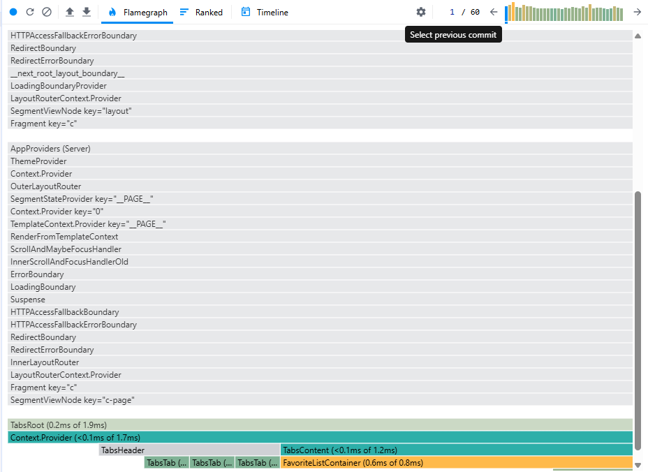

# OPTIMIZATIONS.md

## Optimización de React en el proyecto

Este documento describe las optimizaciones aplicadas al código para mejorar el rendimiento y la mantenibilidad de la aplicación React + Next.js.

---

### 1. React.memo en componentes de presentación

**Componentes optimizados:**
- `RecipeCard`
- `FavoriteCard`

**¿Qué hace?**
Evita renders innecesarios de componentes funcionales si sus props no han cambiado.

**Ejemplo:**
```tsx
export const RecipeCard = React.memo(function RecipeCard(props) { ... });
```

---

### 2. useMemo para cálculos costosos

**Dónde:**
- `RecipeListContainer` (filtrado de recetas)

**¿Qué hace?**
Memoriza el resultado de una función costosa (por ejemplo, filtrar recetas) y solo recalcula si las dependencias cambian.

**Ejemplo:**
```tsx
const filteredRecipes = useMemo(() => recipes.filter(r => r.title.length > 20), [recipes]);
```

---

### 3. useCallback para handlers

**Dónde:**
- `RecipeListContainer` (handler de borrado)

**¿Qué hace?**
Memoriza funciones para evitar que se redefinan en cada render, útil para pasar handlers a componentes hijos y evitar renders innecesarios.

**Ejemplo:**
```tsx
const handleDelete = useCallback((id: string) => { ... }, []);
```

---

### 4. setTimeout en useEffect para evitar renders en cascada

**Dónde:**
- `RecipeListContainer`
- `FavoriteListContainer`
- `useAsync` (hook)

**¿Qué hace?**
Evita que el efecto se ejecute durante el render inicial, previniendo renders en cascada y mejorando la experiencia de usuario.

**Ejemplo:**
```tsx
useEffect(() => {
  setTimeout(() => { ... }, 0);
}, []);
```

---

### 5. Tests robustos y deterministas

- Los tests de integración ahora pasan datos de prueba como prop (`initialRecipes`) en vez de depender de mocks de módulos, asegurando resultados predecibles y sin problemas de caché.

---

## Impacto de las optimizaciones
- Menos renders innecesarios.
- Mejor rendimiento en listas grandes.
- Código más fácil de testear y mantener.
- Tests confiables y rápidos.

---

## Evidencia visual con React DevTools Profiler

A continuación se muestra una captura del Profiler donde se observa la reducción de renders innecesarios tras las optimizaciones:



---

**Última actualización:** 21/04/2026
